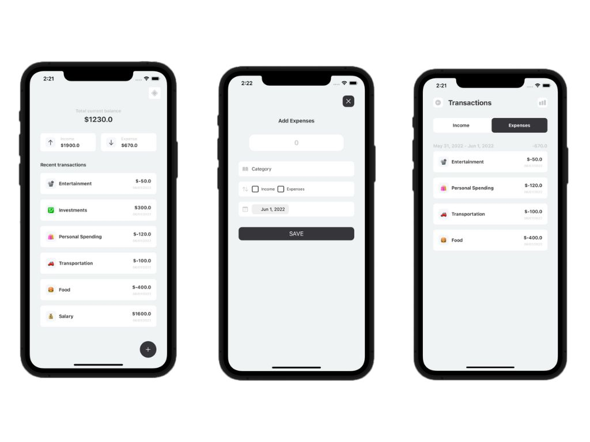

 

  <h3 align="center">Expense Tracker</h3>

  

    App para organização de despesas
  

  
Índice

    <ol>
    <li>
      <a href="#sobre-o-projeto">Sobre o projeto</a>
      <ul>
        <li><a href="#construido-com">Construido com</a></li>
      </ul>
    </li>
    <li><a href="#contato">Contato</a></li>
  </ol>

## Sobre o projeto

Esse aplicativo permite adicionar seus ganhos e suas despesas e separá-los em categorias. Também permite filtrá-los entre duas datas escolhidas. Tudo isso com um design simples e intuitivo. 

### Construído com

O projeto foi construído utilizando:

- [Swift](https://www.swift.org/)
- [RxSwift](https://github.com/ReactiveX/RxSwift)

## Contato

William James - william.james.pj@gmail.com

Link do projeto: [https://github.com/william-james-pj/ExpenseTracker](https://github.com/william-james-pj/ExpenseTracker)
